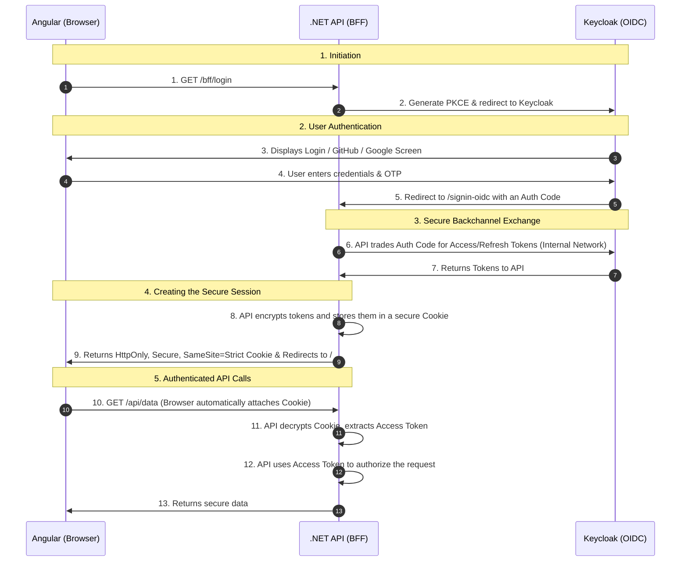

# Backend Onboarding & .NET Course

Welcome to the Normora backend! This guide is tailored for developers who might be coming from Node.js, Go, or Python, and need to quickly understand the architectural patterns used in this **.NET 10 Modular Monolith**.

---

## 1. The Modular Monolith Architecture

Normora is deployed as a single API process, but internally it is strictly divided into bounded contexts (Modules) in the `server/Modules/` directory.

**Rules of the Modular Monolith:**
1. **No Shared Database**: Each module (`Tenants`, `Documents`, `Conversations`, `Users`) has its own `DbContext` and its own schema in PostgreSQL.
2. **No Direct Joins**: You cannot write a LINQ query that joins a `Document` with a `Tenant`. You must query by IDs across boundaries.
3. **Cross-Module Communication**: If the `Documents` module needs to know if a user has access, it doesn't query the `TenantsDbContext`. It sends a MediatR query to the `Tenants` module's API contract.

---

## 2. MediatR and CQRS

We use the **Command Query Responsibility Segregation (CQRS)** pattern heavily, facilitated by the `MediatR` library. 

Instead of bloated "Service" classes, every action is a standalone class.
- **Commands**: Modify state (e.g., `CreateDocumentCommand`). They return `void` or the ID of the created entity.
- **Queries**: Read state (e.g., `GetConversationQuery`). They do not modify the database.

### Example: A Request Lifecycle

1. **The Controller**: Receives the HTTP request and immediately dispatches it.
```csharp
[HttpPost]
[RequireTenant("employer")]
public async Task<IActionResult> Create([FromBody] CreateDepartmentCommand command)
{
    var id = await _mediator.Send(command);
    return Ok(new ApiResponse<Guid>(id));
}
```

2. **The Handler**: The actual business logic lives here.
```csharp
public class CreateDepartmentCommandHandler : IRequestHandler<CreateDepartmentCommand, Guid>
{
    private readonly TenantsDbContext _db;
    private readonly ITenantContext _tenantContext;

    public CreateDepartmentCommandHandler(TenantsDbContext db, ITenantContext tenantContext)
    {
        _db = db;
        _tenantContext = tenantContext; // Automatically resolved from headers
    }

    public async Task<Guid> Handle(CreateDepartmentCommand request, CancellationToken ct)
    {
        var dept = new Department { Name = request.Name, TenantId = _tenantContext.TenantId };
        _db.Departments.Add(dept);
        await _db.SaveChangesAsync(ct);
        return dept.Id;
    }
}
```

---

## 3. Authentication & BFF

Normora uses the **Backend-For-Frontend (BFF)** pattern powered by `Duende.BFF`.



### Detailed Breakdown

#### 1. Initiation
When you click "Login" in Angular, it doesn't talk to Keycloak directly. Instead, it navigates to the .NET API at `/bff/login`. The API generates a secure challenge (PKCE) and redirects your browser to Keycloak.

#### 2. User Authentication
You land on the Keycloak login screen (`http://localhost:8080`). You enter your password, do the OTP challenge, or click GitHub. Keycloak verifies who you are.

#### 3. The Callback & Backchannel (Where the magic happens)
Once Keycloak approves you, it redirects your browser *back* to the API at `http://localhost:4200/signin-oidc` with a temporary, one-time-use **Authorization Code**.
- The API takes this code and secretly talks to Keycloak over the internal Docker network (`http://keycloak:8080`).
- The API trades the Authorization Code for your real Access Token and Refresh Token. 
- *Crucially, these tokens never touch your browser.*

#### 4. The Secure Cookie
Because your Angular app needs a way to prove it's logged in, the API takes those tokens, encrypts them, and wraps them in a highly secure **Cookie** (named `normora-auth` or `__Host-spa`).
- **HttpOnly**: JavaScript cannot read it (immune to XSS attacks).
- **Secure**: It can only be sent over HTTPS.
- **SameSite=Strict**: It can only be sent to your exact API, preventing Cross-Site Request Forgery (CSRF).

#### 5. Authenticated API Calls
From now on, whenever Angular makes an HTTP request to the API (e.g., fetching a user profile), the browser *automatically* attaches that secure cookie. 
The API decrypts the cookie, finds the Keycloak Access Token inside, validates it, and processes your request!

> [!NOTE]
> All of the "weird" configuration we did earlier (like setting `KC_HOSTNAME_URL` and creating the `DockerOidcBackchannelHandler`) was necessary to ensure Step 3 and Step 6 could happen seamlessly across both the public browser network and the internal Docker network simultaneously.

#### 6. Server-Side Session Persistence
By default, Duende BFF stores user sessions in memory. This means every time the backend container restarts, all users are logged out. To fix this, we use the official `Duende.BFF.EntityFramework` library to persist sessions in our **PostgreSQL** database. 
- You do **not** need to manually create C# models for this table. The library provides the `SessionDbContext` and the required models out of the box. 
- The EF Core migrations tool reads these built-in models and automatically generates the `UserSessions` table for us.

3. **Anti-Forgery (CSRF)**: All mutating requests (`POST`, `PUT`, `DELETE`) require an `X-CSRF: 1` header, which is enforced globally by the `AsBffApiEndpoint()` convention in `Program.cs`.

### Docker Reverse-Proxy Gotcha
When running in Docker, the API sits behind an nginx reverse proxy. The API container's internal hostname is `api:8080`, but the browser-facing public URL is `localhost:4200`. 

If not corrected, the OIDC middleware will build an `redirect_uri` pointing to `api:8080/signin-oidc`, which Keycloak will reject as an unregistered URI.

**Fix**: `UseForwardedHeaders` is registered early in `Program.cs`:
```csharp
var forwardedHeadersOptions = new ForwardedHeadersOptions
{
    ForwardedHeaders = ForwardedHeaders.XForwardedFor 
                     | ForwardedHeaders.XForwardedHost 
                     | ForwardedHeaders.XForwardedProto
};
// IMPORTANT: By default, ASP.NET Core only trusts loopback proxies (127.0.0.1).
// In Docker, nginx runs on an internal bridge network (172.x.x.x) which is NOT loopback.
// Without clearing these lists, the X-Forwarded-Host header is silently ignored
// and redirect_uri is built from the internal Docker hostname (api:8080), not localhost:4200.
forwardedHeadersOptions.KnownNetworks.Clear();
forwardedHeadersOptions.KnownProxies.Clear();
app.UseForwardedHeaders(forwardedHeadersOptions);
```

nginx injects `proxy_set_header X-Forwarded-Host $host;` so the API correctly reads `localhost:4200` as the public host when building OIDC URLs.

> **Rule of thumb**: Always register `UseForwardedHeaders` **before** `UseAuthentication` and `UseBff` in any Docker/reverse-proxy deployment. Always clear `KnownNetworks` and `KnownProxies` when nginx is in a Docker network.

---

## 4. Security: BOLA & BFLA Prevention

We strictly prevent Broken Object Level Authorization (BOLA) and Broken Function Level Authorization (BFLA) using context injection.

### `ITenantContext`
Never trust the `TenantId` sent in a JSON body. The `TenantResolutionMiddleware` intercepts the `X-Tenant-Id` header, verifies the user is actually a member of that tenant in the database, and injects the `ITenantContext` into the DI container.

### `[RequireTenant]` Attribute
Controllers use this to enforce BFLA. 
```csharp
[RequireTenant("employer")] // Only Employers in the current tenant can call this
public async Task<IActionResult> DeleteDocument(Guid id) ...
```

---

## 4. Entity Framework Core (EF Core)

We use EF Core as our ORM. 

### Global Query Filters
We use global filters to enforce soft deletes and tenant isolation at the database level.
```csharp
// In TenantsDbContext.cs
builder.Entity<Tenant>().HasQueryFilter(t => !t.IsDeleted);
```

### Migrations
Because we have multiple `DbContexts`, you must specify the context when creating migrations:
```bash
dotnet ef migrations add AddUserGroups --context TenantsDbContext --project Modules/Normora.Modules.Tenants
dotnet ef database update --context TenantsDbContext
```

---

## 5. Dependency Injection (DI)

.NET has built-in DI. Services are registered in the `Program.cs` or in extension methods (e.g., `ApplicationServiceExtensions.cs`).

- `AddTransient`: Created every time they are requested.
- `AddScoped`: Created once per HTTP request (Use this for DbContexts and tenant-aware services).
- `AddSingleton`: Created once for the lifetime of the application.
