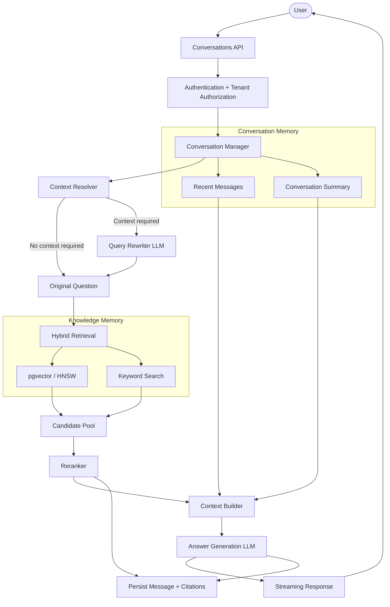
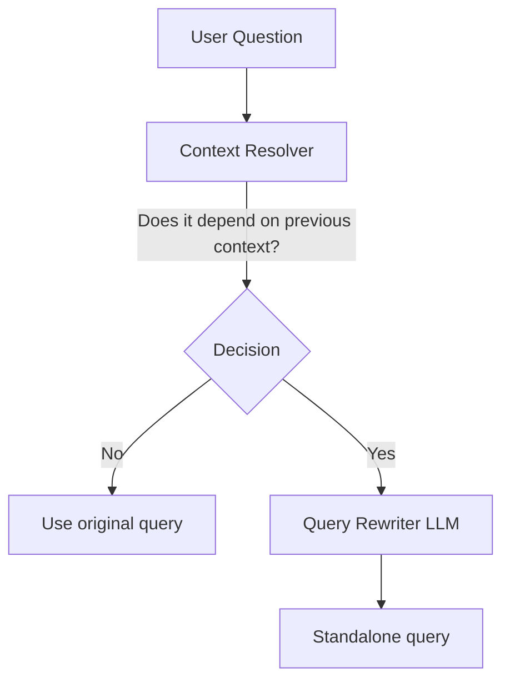

# Conversational RAG Architecture Implementation Plan

This document defines the end-to-end design and implementation strategy to upgrade Normora's existing single-turn RAG (Retrieval-Augmented Generation) system into a production-grade multi-turn conversational AI.

The design separates:
- **Knowledge Memory** — documents, chunks, embeddings, metadata, and authorization rules.
- **Conversation Memory** — conversations, messages, summaries, and citations.
- **Question Understanding** — determining whether the current question depends on conversation context and, when necessary, rewriting it into a standalone retrieval query.
- **Retrieval Orchestration** — hybrid retrieval, authorization filtering, and reranking.
- **Answer Generation** — grounded response generation using the best available sources.

> [!IMPORTANT]
> This implementation plan is intended to be the baseline architecture for the conversational RAG implementation. The implementation should prioritize correctness, tenant isolation, observability, and retrieval quality over premature infrastructure expansion.

## 1. Architecture Decisions

The following decisions are recommended as the implementation baseline.

| Area | Decision |
|------|----------|
| Conversation database | PostgreSQL |
| Knowledge/vector storage | Existing PostgreSQL + pgvector |
| Vector index | HNSW |
| Dedicated vector database | Not required initially |
| Query rewriting | Small/fast LLM, invoked only when context is required |
| Retrieval | Hybrid semantic vector + keyword retrieval |
| Reranking | Rerank the candidate pool before final context construction |
| Conversation context | Recent messages + rolling summary, with room for relevant historical-message retrieval later |
| Tenant isolation | Authentication + authorization + tenant-aware queries + EF Core global filters |
| Streaming | Continue using streaming responses |
| Citations | Persist stable document/chunk references and retrieval metadata |
| Retention | Configurable cleanup policy |
| Backend module | Dedicated `Normora.Modules.Conversations` module |
| Migration | Incremental rollout with old single-turn API retained during transition |

The architecture deliberately avoids introducing a dedicated vector database until actual scale or operational requirements justify it.

## 2. High-Level Architecture & Request Flow

When a user submits a message, the system should execute the following lifecycle:
1. Authenticate and resolve tenant/user context.
2. Load the conversation and recent context.
3. Determine whether the current question depends on previous conversation context.
4. If context is required, invoke the Query Rewriter using a small/fast LLM.
5. Produce the effective retrieval query.
6. Run tenant-authorized hybrid retrieval against the knowledge base.
7. Rerank the retrieved candidate chunks.
8. Build the final LLM context from authoritative documents, recent conversation context, and conversation summary.
9. Generate a grounded answer with citations.
10. Stream the answer to the client.
11. Persist the user message, assistant message, retrieval query metadata, and citations.
12. Update conversation metadata and rolling summary when required.

### Request Flow



## 3. Core Architectural Principles

### 3.1 Knowledge Memory and Conversation Memory Must Remain Separate
- Documents and document chunks represent the authoritative knowledge base.
- Conversations represent interaction state.
- Do not use the vector store as the primary conversation database.

**Knowledge Memory**
- Documents
- DocumentChunks
- Embeddings
- Access Control Metadata

**Conversation Memory**
- Conversations
- Messages
- MessageCitations
- Conversation Summaries

This separation keeps retrieval independently manageable from conversation lifecycle management.

### 3.2 Documents Have Higher Factual Authority Than Conversation History
- Conversation history is used for continuity and question interpretation.
- Retrieved documents are the factual source of truth.
- If a previous assistant response conflicts with the currently retrieved authoritative document, the document should win.
- The final generation prompt should explicitly enforce this priority.

### 3.3 Retrieval Must Be Tenant-Aware
- Tenant authorization must be applied before retrieved content enters the LLM context.
- The system must never allow:
  `Tenant A request` -> `Retrieval` -> `Tenant B document chunk`
- Tenant filtering must be enforced in the retrieval path itself, not only on conversation tables.

## 4. Conversation Memory Database Schema

A dedicated conversation schema should be introduced in PostgreSQL.

### 4.1 Conversations
- `Id`: Guid, PK
- `TenantId`: Guid, FK
- `UserId`: Guid, FK
- `Title`: String, Max 200
- `Summary`: Text, Nullable
- `SummaryVersion`: Int
- `CreatedAt`: DateTimeOffset
- `UpdatedAt`: DateTimeOffset
- `LastMessageAt`: DateTimeOffset

**Notes:**
- TenantId is mandatory for tenant isolation.
- UserId identifies the conversation owner.
- Title can be generated after the first few messages.
- Summary contains a rolling summary for long conversations.
- SummaryVersion allows summary regeneration and future migrations.
- UpdatedAt and LastMessageAt support sorting and cleanup jobs.

### 4.2 Messages
- `Id`: Guid, PK
- `ConversationId`: Guid, FK
- `TenantId`: Guid, FK
- `Role`: Enum: User | Assistant | System
- `Content`: Text
- `CreatedAt`: DateTimeOffset
- `TokenCount`: Int, Nullable
- `RequiresContext`: Bool
- `Rewritten`: Bool
- `RetrievalQuery`: Text, Nullable
- `ProcessingMetadata`: Json/JsonB, Nullable

**Notes:**
- Do not make `IsFollowUp` the primary business concept. A more precise model is:
  - `RequiresContext` — whether the current message depends on previous conversation context.
  - `Rewritten` — whether the retrieval query was rewritten.
  - `RetrievalQuery` — the effective query used for retrieval.
  - `ProcessingMetadata` — optional structured metadata for diagnostics and future evolution.
- The original user content must remain unchanged.
- The rewritten query is retrieval metadata, not a replacement for the user's actual question.

### 4.3 MessageCitations
- `Id`: Guid, PK
- `MessageId`: Guid, FK
- `DocumentId`: Guid, FK
- `DocumentChunkId`: Guid, FK
- `Rank`: Int
- `Score`: Double
- `RetrievalMethod`: Enum: Vector | Keyword | Hybrid
- `RerankScore`: Double, Nullable

**Notes:**
- Prefer a stable `DocumentChunkId` over storing only `ChunkIndex`. This allows chunk identity to remain stable even if chunk ordering changes.
- Persist retrieval metadata so the team can later diagnose why a source was selected, which retrieval method found it, its initial retrieval rank, and its reranking score.

### 4.4 Tenant Isolation
All conversation entities should implement the existing tenant abstraction, for example: `ITenantEntity` and use EF Core global query filters:
```csharp
modelBuilder.Entity<Conversation>()
    .HasQueryFilter(c => c.TenantId == _tenantContext.TenantId);
```
Equivalent filters should be applied to Messages, MessageCitations, and any other tenant-owned conversational entities.

However, global query filters are not the only security boundary. Tenant authorization must also be explicitly enforced in:
- API authorization.
- Conversation ownership checks.
- Document retrieval.
- Citation access.
- Any direct database query that can bypass normal application services.

## 5. Question Understanding and Query Rewriting

### 5.1 Do Not Rewrite Every Question
The system should not invoke an LLM query-rewriter for every message. Use a lightweight context-resolution step first.



**Examples:**
- *No rewrite required*: "What is our employee leave policy?" -> Use the original query.
- *Rewrite required*: 
  - Previous: "What is the refund policy?"
  - Current: "Does this apply to enterprise customers?"
  - Rewrite to: "Does the 30-day refund policy apply to enterprise customers?"

### 5.2 Query Rewriter Responsibilities
The query rewriter must:
- Resolve pronouns such as it, this, they, and that.
- Resolve references to previous entities or topics.
- Preserve the actual intent of the user's question.
- Produce a standalone retrieval query.
- Never answer the question.
- Return structured output.
- Treat unrelated questions as standalone.

**Recommended Output:**
```json
{
  "requiresContext": true,
  "standaloneQuery": "Does the 30-day refund policy apply to enterprise customers?"
}
```
For a standalone query:
```json
{
  "requiresContext": false,
  "standaloneQuery": "What is our employee leave policy?"
}
```

### 5.3 Rewriter Input
Use:
- Latest user message.
- Recent conversation messages.
- Conversation summary when available.

Initial implementation can use the last 4-6 messages. Do not permanently constrain the architecture to only the last N messages. As the product matures, the conversation memory layer can support retrieval of relevant historical messages.

## 6. Conversation Context Strategy

The final context should be hierarchical.
1. System Instructions
2. Retrieved Authoritative Documents
3. Current User Question
4. Relevant Recent Conversation
5. Conversation Summary

**Context Purposes:**
- *System instructions*: Define behavior and grounding rules
- *Retrieved documents*: Provide authoritative facts
- *Current question*: Define the task
- *Recent conversation*: Maintain local continuity
- *Summary*: Preserve long-term conversation state

### 6.1 Initial Token Budget
A practical initial budget can be:
- System Instructions: ~200 tokens
- Retrieved Documents: ~2000 tokens
- Recent Messages: ~500 tokens
- Conversation Summary: ~300 tokens

These numbers are starting targets rather than hard-coded limits. The context builder should enforce a total token budget and dynamically reduce lower-priority context when necessary.

### 6.2 Sliding Window
For normal conversations:
`Recent messages + Conversation summary + Current question`

For long conversations:
`Conversation summary + Recent messages + Relevant retrieved documents`

Do not blindly inject the full conversation history into every LLM call.

## 7. Hybrid Retrieval Architecture

The retrieval layer should use a hybrid strategy.

```text
Effective Retrieval Query
          ↓
    ┌───────────────┐
    │ Hybrid Search │
    └───────┬───────┘
            │
      ┌─────┴─────┐
      ↓           ↓
Vector Search   Keyword Search
pgvector        Text/keyword
      ↓           ↓
      └─────┬─────┘
            ↓
      Candidate Pool
            ↓
         Reranker
            ↓
       Top Chunks
```

### 7.1 Vector Search
Continue using PostgreSQL with pgvector. Use HNSW indexing for approximate nearest-neighbor search. A dedicated vector database such as Pinecone or Qdrant should not be introduced initially. Evaluate a dedicated vector database later only when actual scale, latency, operational, or maintenance requirements justify it.

### 7.2 Keyword Search
Keyword search helps when questions contain:
- Exact policy names.
- Product names.
- Codes.
- Acronyms.
- Names of departments.
- Specific terminology.

The implementation can use the existing PostgreSQL text-search capability or the project's established keyword-search mechanism.

### 7.3 Candidate Pool
Do not immediately pass the raw vector top-K results to the LLM. Combine candidates from Vector search and Keyword search, then deduplicate them.

## 8. Reranking

Introduce a reranking stage between candidate retrieval and context construction. Reranking improves the probability that the most relevant chunks reach the generation model.

The exact reranking technology can remain implementation-specific initially. The interface should be abstracted:
```csharp
public interface IRetrievalReranker
{
    Task<IReadOnlyList<RankedChunk>> RerankAsync(
        string query,
        IReadOnlyList<RetrievedChunk> candidates,
        CancellationToken cancellationToken);
}
```
This keeps the retrieval architecture independent from a particular reranking provider.

## 9. Retrieval Authorization

Document retrieval must continue to respect the existing document authorization model. For example: Company Wide vs Department Scoped. The retrieval query must ensure the user is entitled to the document/chunk before it can enter the candidate pool.

**Recommended flow:**
`User/Tenant Identity -> Authorization Context -> Hybrid Retrieval -> Authorized Candidate Pool -> Reranking -> LLM Context`

Filtering unauthorized documents after the LLM context has already been assembled is too late.

## 10. Context Builder

Introduce a dedicated `IContextBuilder/ContextBuilder` responsible for constructing the final generation prompt.

**Responsibilities:**
- Apply token budgets.
- Prioritize authoritative retrieved chunks.
- Add recent conversation context.
- Add summary when appropriate.
- Preserve citation/source identifiers.
- Avoid duplicate chunks.
- Remove low-value context when the token budget is exceeded.

The system prompt must explicitly instruct the generation model that retrieved documents have higher factual authority than previous assistant statements.

## 11. Answer Generation

The main LLM is responsible for:
- Answering the current question.
- Using only the provided sources for factual claims.
- Maintaining conversational continuity.
- Avoiding unsupported claims.
- Returning an explicit "not found" response when evidence is insufficient.
- Referencing the retrieved source chunks.

The model should not be responsible for deciding tenant authorization. Authorization must already be enforced before the prompt is constructed.

## 12. API Contracts

### 12.1 Create Conversation
`POST /api/conversations`
Example response:
```json
{
  "conversationId": "conv_abc123",
  "title": "New conversation",
  "createdAt": "2026-09-09T12:00:00Z"
}
```

### 12.2 Add Message
`POST /api/conversations/{conversationId}/messages`
Request:
```json
{
  "content": "Does this apply to enterprise customers?",
  "idempotencyKey": "client-generated-unique-value"
}
```
Response:
```json
{
  "messageId": "msg_abc123",
  "role": "assistant",
  "content": "Yes, the 30-day refund policy also applies to enterprise customers.",
  "metadata": {
    "requiresContext": true,
    "rewritten": true,
    "retrievalQuery": "Does the 30-day refund policy apply to enterprise customers?",
    "citations": [
      {
        "documentId": "doc_456",
        "documentChunkId": "chunk_789",
        "fileName": "Refund Policy.pdf",
        "rank": 1,
        "retrievalMethod": "Hybrid",
        "score": 0.89,
        "rerankScore": 0.96
      }
    ]
  }
}
```

### 12.3 List Conversations
`GET /api/conversations`
Return conversations owned by the current user, sort by LastMessageAt descending, support pagination, do not load all messages.

### 12.4 Get Conversation
`GET /api/conversations/{conversationId}`
Returns conversation metadata, paginated or bounded message history, citation metadata.

### 12.5 Delete Conversation
`DELETE /api/conversations/{conversationId}`
Deletion must verify tenant ownership, user authorization, and any relevant retention/audit requirements.

## 13. Idempotency and Duplicate Requests
Message submission should support an idempotency mechanism to protect against browser retries, network retries, reverse proxy retries, and client-side duplicate submission. The same idempotencyKey must not result in duplicate assistant messages.

## 14. Frontend Architecture (Angular)

Build the new chat experience around the conversation abstraction.

**Key Components & Responsibilities:**
- `ConversationListComponent`: List recent conversations, create a new conversation, select an existing conversation, delete/rename conversations.
- `ChatComponent`: Load selected conversation, send messages, handle streaming, coordinate loading/error state.
- `MessageInputComponent`: Handle user input, submit messages, disable submission while appropriate, support retry after transient failures.
- `MessageComponent`: Render markdown, assistant/user roles, citations, processing/retry states.
- `CitationComponent`: Render citations as interactive elements. Clicking a citation should display the exact authorized source chunk where possible.

## 15. Conversation State Management

Initial implementation can use a dedicated `ConversationService`.
Optimistic UI: User submits -> Message appears immediately -> Loading/streaming state -> Assistant response arrives -> Final state persisted. The client should gracefully reconcile optimistic state with the final server response.

## 16. Conversation Summarization

Long conversations should maintain a rolling summary. The summary should capture important entities, decisions made, user intent, relevant constraints, and important topics already discussed. It should not attempt to replace the authoritative document retrieval mechanism.

Recommended trigger: `Messages > threshold -> Update rolling summary`. The initial threshold can be around 10 messages, but should remain configurable.

## 17. Conversation History Retrieval: Future Enhancement
Do not require semantic search over conversation messages for the first implementation. Start with recent messages + rolling summary. Later, if real usage demonstrates that users frequently refer to much older conversation turns, add conversation history retrieval.

## 18. Observability & Telemetry

Track each major stage independently using metrics (e.g. `normora.rag.query_rewrite_latency_ms`, `normora.rag.llm_generation_latency_ms`).

### 18.1 Privacy
Do not write raw user messages or raw model responses to central logs by default. The RetrievalQuery itself should be treated as potentially sensitive and must follow the application's existing logging/privacy policy.

## 19. Failure Handling & Fallbacks

- **Context Resolver Failure**: Treat current question as standalone -> Normal retrieval.
- **Query Rewriter Failure**: Use latest user message as retrieval query -> Continue retrieval.
- **No Documents Found**: Return standardized "Not found" response (e.g. "I could not find that in the company documents."). Do not hallucinate.
- **LLM Rate Limit / Timeout**: Return a user-friendly transient error and provide retry behavior.
- **Partial Streaming Failure**: Mark the message as failed/incomplete. Preserve any client-side partial output only as transient state.

## 20. Security Architecture

Tenant security is a critical requirement. Security controls must be layered:
`Authentication -> Tenant Resolution -> Authorization -> Conversation Ownership Validation -> Tenant-Aware Database Queries -> Tenant-Aware Document Retrieval -> Authorized LLM Context`

- **API authorization**: All conversation endpoints require the authenticated tenant/user context.
- **Tenant filters**: Apply tenant filters at the EF Core layer.
- **Ownership checks**: A user must not be able to access another user's conversation merely because they know its ID.
- **Document authorization**: Retrieval must respect document department/access rules.
- **Citation authorization**: A client must not be able to use a citation identifier to retrieve an unauthorized document chunk.

## 21. Data Retention
Conversation retention should be configurable (e.g., 180 days default) with a scheduled cleanup job.

## 22. Performance Strategy
Avoid unnecessary LLM calls. The common path (simple standalone question) bypasses the rewriter, making it cheaper and faster.

## 23. Model Strategy
Use different model responsibilities where appropriate:
- **Query Rewriter**: Prefer a smaller, faster model (latency and cost matter).
- **Answer Generation**: Use the primary production LLM for grounded answer generation.

Model names should remain configurable via abstractions (e.g., `IQueryRewriterService`, `IAnswerGenerationService`).

## 24. Backend Module Structure

Create a dedicated module:
```
server/
└── Modules/
    └── Normora.Modules.Conversations/
        ├── Application/
        │   ├── Commands/
        │   ├── Queries/
        │   └── Services/
        ├── Domain/
        │   ├── Conversation.cs
        │   ├── Message.cs
        │   └── MessageCitation.cs
        ├── Infrastructure/
        │   ├── Persistence/
        │   │   └── ConversationsDbContext.cs
        │   └── Llm/
        └── Controllers/
            └── ConversationsController.cs
```

## 25. Main Application Pipeline

The primary application use case (`SendMessageCommandHandler`) orchestrates the flow behind services without creating one massive handler.

## 26. Migration Strategy

- **Phase 1 — Foundation**: Implement DB schema, EF Core migrations, Tenant filters, Conversation CRUD.
- **Phase 2 — Conversation-aware Question Understanding**: Implement `IContextResolver`, `IQueryRewriterService`, Standalone query generation.
- **Phase 3 — Retrieval Upgrade**: Hybrid retrieval, Candidate deduplication, Tenant authorization filtering, Reranking.
- **Phase 4 — Context Builder and Answer Generation**: Token budgeting, Sliding window, Rolling summary, Grounded generation.
- **Phase 5 — Conversations API**: New endpoints, idempotency handling.
- **Phase 6 — Angular Chat UI**: New UI coexisting with the old Ask UI.
- **Phase 7 — Observability and Hardening**: Metrics, error telemetry, security tests.
- **Phase 8 — Cutover**: Switch Angular UI to new API, deprecate `/api/ask` after usage confirms it's no longer required.

## 27. Testing Strategy
Unit tests, integration tests, security tests, and RAG evaluation tests (measuring retrieval relevance, citation correctness, answer grounding).

## 28. Recommended Initial Configuration
Use configurable settings rather than hard-coding values (e.g. `RecentMessageCount = 6`, `SummaryTriggerMessageCount = 10`, `FinalChunkCount = 5-8`).

## 29. Important Non-Goals for the Initial Version
Do not introduce dedicated Pinecone/Qdrant, semantic search over historical messages, multiple rewriter LLM passes, or full conversation replay into every prompt unless there is a concrete requirement.

## 30. Final Architecture

The recommended production flow is a highly decoupled pipeline ensuring secure, tenant-isolated conversational RAG without premature scaling complexity.

## 31. Final Recommendation

This architecture should be treated as the implementation baseline for Normora's conversational RAG. It keeps PostgreSQL + pgvector, separates conversation memory from knowledge memory, uses hybrid vector + keyword retrieval, and enforces strict tenant isolation at all levels.
